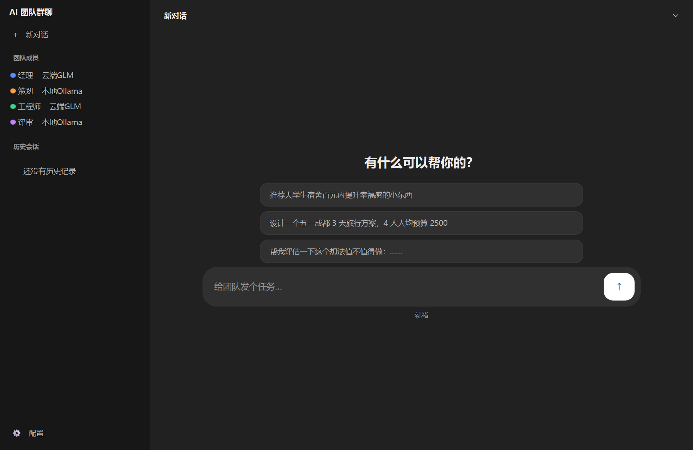

# AI 团队群聊(桌面版)

[](LICENSE)
[](https://www.python.org)
[](#-快速开始)
[](https://github.com/tangyuan1129/ai-group-chat-desktop/releases)

让几个 AI 在同一个窗口里互相讨论,而不是每次只跟一个 AI 你问我答。每个角色可以挂**不同的模型**——云端 GLM 加本地跑的开源模型——它们观点真的会不一样,讨论起来有来有回,有时候还会互相反驳。

装好之后,输入一句任务,比如:

> 推荐大学生宿舍百元内提升幸福感的小东西

几个 AI 就会按你排好的顺序轮流发言:有人拆问题,有人提方案,有人查资料,最后有人负责验收。聊完可以**接着追问**,它们记得前面聊过什么。

## ✨ 功能特性

- **角色完全自定义** —— 想加几个 AI 就加几个,随时增删改;每个角色单独配名称、颜色、模型来源、凭据、人设和可用工具,发言顺序就是列表顺序。内置经理/策划/工程师/评审/研究员/唱反调/执笔等预设,点一下就能加
- **可以一直追问** —— 讨论完直接接着问"把预算再压低 20%",它们记得之前的上下文;想重新开始点「新会话」
- **逐字流式显示** —— 不用盯着空屏等一整段生成完
- **各家模型随便接** —— 智谱 GLM(有免费额度)、本地 [Ollama](https://ollama.com)、任何 OpenAI 兼容接口(DeepSeek、Kimi 之类)
- **API Key 加密保存** —— 用 Windows 自带的 DPAPI 按当前用户加密,配置文件里看不到明文
- **AI 会用几个小工具** —— 联网搜索、读写文件、查 GitHub、执行只读命令,每个角色能用的工具可以单独勾
- **界面是 ChatGPT 那种布局** —— 左侧会话栏、正文居中、底部圆角输入框;整屏几乎不用彩色,颜色只留给角色标记
- **配置面板随时可开** —— 没有首次启动教程,想改随时点「配置」;缺什么会直接在对话流里提示
- **自动存档** —— 每次讨论都会存下来,回看时还能看到当时用的模型配置
- **出问题查得到** —— 有日志,「⋯ → 导出诊断包」一键打包(密钥自动脱敏),直接发给开发者即可

## 🚀 快速开始

### 方式一:最省事(推荐)

去 [Releases 页面](https://github.com/tangyuan1129/ai-group-chat-desktop/releases) 下载 `AI-Group-Chat-Setup-v1.2.2.exe`,双击安装就行。不需要自己配 Python 环境。

### 方式二:源码运行

需要 Python 3.10+(建议 3.11/3.12),本地模型还需要装 [Ollama](https://ollama.com)(不装也能用,只是少一个本地模型):

```bat
pip install -r requirements.txt
```

然后双击 **`启动（无黑窗）.vbs`** 启动(全程不闪任何黑色控制台窗口)。
如果习惯用批处理,双击 `start_desktop.bat` 也行,只是会闪一下命令行窗口。

第一次打开时,对话流里会有一条提示告诉你还缺什么,点「去配置」:

1. 填智谱 GLM 的 API Key(最省事,有免费额度)——去 [open.bigmodel.cn](https://open.bigmodel.cn) 或 [api.z.ai](https://api.z.ai) 申请
2. 需要的话点「测试全部」,确认每个角色都能连通
3. 保存

> 注意:国内站(open.bigmodel.cn)和国际站的 Key **互不通用**,申请哪个站就在「接口地址」里选哪个。

## 📸 界面预览



<!-- 群聊讨论截图还没补上：capture_ui_states.py 里那份讨论是 FakeTeam 编的
     占位发言（存在 _ui_shots/2_running.png），拿它当宣传图是骗人的。
     要补得跑一次真实讨论：配好模型，自己聊一轮，把截图存成
     screenshots/discussion.png，再放开下面这行。 -->
<!--  -->

## 💡 用法

- **改角色**:点侧栏底部的「⚙ 配置」(或右上角 ⋯)。左边是角色列表,可以添加、编辑、删除、上移下移、启用停用;右边是共享凭据和单轮上限
- **翻历史**:左侧会话栏按「今天 / 昨天 / 更早」列出以前的讨论,点一条就能只读回看
- **追问**:一轮讨论结束后,直接在输入框里接着问。输入框提示会变成"继续追问…",说明上下文还在
- **新会话**:点「🧹 新会话」清空上下文重新开始(上一轮的记录已经存进历史了)
- **停止**:讨论中途可以停。正常是"优雅停止",**上下文会保留**,可以直接接着问;只有极少数情况(网络挂死)才会强制中断并重置上下文,那时界面会明确告诉你
- **排查问题**:「⋯ → 导出诊断包」会生成一个 zip(含日志和环境信息,**密钥已自动脱敏**),出问题把它发出来就行

## ⚠️ 注意事项

- **文件工具**只能读写"文档"目录下的 `AI团队群聊` 文件夹,路径越界会被拒绝(含符号链接/junction 逃逸)
- **命令工具**只能执行查询类命令,而且工作目录被锁在那个文件夹里;`.env`、配置文件、SSH 私钥、浏览器凭据等敏感文件一律拒绝读取。**AI 要看文件内容请用 `read_text_file`**,不要用 `Get-Content`
- 数据都存在用户目录下,不依赖安装位置,也不需要管理员权限:
  - 配置、聊天记录、日志 → `%APPDATA%\AI团队群聊\`
  - AI 产出的文件 → `文档\AI团队群聊\`
- 智谱免费接口偶尔限流(429),程序会自动等一会儿重试,不用管它
- 这是个人业余项目,遇到问题直接提 [issue](https://github.com/tangyuan1129/ai-group-chat-desktop/issues) 即可

## 📁 目录结构

```
├── desktop_app.py      # 主程序:界面与交互
├── theme.py            # ChatGPT 风格配色与样式表(间距/字号/圆角三套尺度)
├── icons.py            # 图标都在这画(不依赖图片资源)
├── team_session.py     # 会话:多轮追问 / 流式输出 / 优雅停止
├── llm.py              # 模型客户端构造与连接测试
├── app_config.py       # 配置、角色列表、校验、损坏恢复
├── secret_store.py     # 密钥加密(Windows DPAPI)
├── app_logging.py      # 日志、脱敏、诊断包
├── tools.py            # AI 的"手臂":搜索 / 文件 / GitHub / 命令
├── glm_client.py       # 智谱 GLM 客户端(含限流自动重试)
├── 启动（无黑窗）.vbs   # 双击启动(推荐,零黑窗)
├── start_desktop.bat   # 批处理启动(会闪一下命令行窗口)
├── pack.spec           # PyInstaller 打包配置
├── install.iss         # Inno Setup 安装脚本
├── requirements.txt
├── .env.example        # 密钥模板(可选,给开发/高级用户)
├── screenshots/        # 界面预览图
└── tests/              # 回归测试(见下)
```

## 🧪 测试

不需要装 pytest,直接跑:

```bat
python tests\test_config.py            :: 角色列表、配置读写、密钥加密、v2 迁移、损坏恢复、版本号对账、代理环境自救
python tests\test_tools_sandbox.py     :: 文件沙箱 + 命令工具拦截
python tests\test_llm_sources.py       :: 四条模型通道都要真能建出客户端(打包验证时踩出来的两个坑)
python tests\test_team_session.py      :: 多轮追问 / 流式 / 优雅停止 / 强制停止兜底
python tests\test_session_cleanup.py   :: 模型连接释放
python tests\test_ui_flow.py           :: 端到端界面流程 + 列宽回归
python tests\prove_old_bugs.py         :: 复现修复前的漏洞(取历史提交对比)
```

## 🔨 从源码构建

```bat
pip install -r requirements.txt pyinstaller
pyinstaller pack.spec --noconfirm
```

产物在 `dist\AI团队群聊\`。要出安装包再用 Inno Setup 6 编译 `install.iss`。

安装包会生成在项目**上一层目录**,文件名就是 Release 上那个英文名
(`AI-Group-Chat-Setup-v<版本>.exe`)。别改成中文名 —— GitHub 会把资产名里的非 ASCII
字符统统换成点,`AI团队群聊-安装程序-v1.2.exe` 上传后变成 `AI.-.-v1.2.exe`,
用户按 README 里的名字根本找不到文件(v1.1 就这么错过一版)。

## 📄 License

MIT
